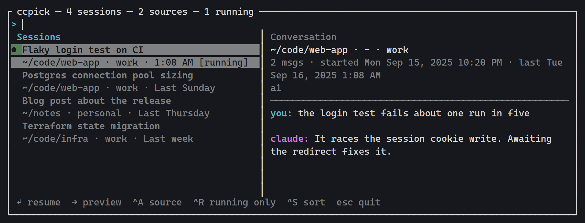

# ccpick

Fast TUI to find and resume Claude Code sessions across every config directory you use —
multiple [ccs](https://github.com/kaitranntt/ccs) accounts, `~/.claude`, `$CLAUDE_CONFIG_DIR`,
or any directory you configure. It doesn't manage sessions; it finds one and hands off to the
right launcher.



- **One list for every account.** ccs accounts, `~/.claude`, `$CLAUDE_CONFIG_DIR` and any
  directory you configure. Accounts that share a transcript store are listed once, and can be
  resumed through any of them (`Ctrl-A` picks).
- **Search as you type.** Titles, project paths, branches and first prompts filter instantly;
  matches inside the conversations themselves arrive a moment later, below a divider.
- **Shows what's running.** Live sessions are marked, with their pid, so you never resume one
  twice.
- **Enter does the right thing.** A stopped session resumes through its own launcher; a running
  one brings its terminal to the front instead, switching to the right tab.
- **Reads across Windows and WSL.** Each side lists the other's sessions, and running state is
  detected both ways. Where ccpick can't launch across the boundary it hands you the command to
  paste (`c` copies it).
- **Conversation preview.** Scroll the transcript beside the list before committing to it.
- **Fast.** A warm start is under 100 ms on a few hundred transcripts; metadata is cached.

## Install

Linux (x86_64, arm64) and macOS (Intel, Apple Silicon):

```bash
curl --proto '=https' --tlsv1.2 -LsSf https://github.com/outsharked/ccpick/releases/latest/download/ccpick-installer.sh | sh
```

Windows (PowerShell):

```powershell
powershell -ExecutionPolicy Bypass -c "irm https://github.com/outsharked/ccpick/releases/latest/download/ccpick-installer.ps1 | iex"
```

On macOS, sessions are listed and resumable but never shown as running.

## Use

```bash
ccpick                 # browse everything
ccpick docker cache    # start with a query
ccpick --list migration  # non-interactive TSV
ccpick --sources       # show discovered sources and stores
ccpick --config-dir ~/.claude-work
```

Type to filter titles, project paths, branches and first prompts instantly; matches inside
conversation text appear below a divider shortly after.

| Key | Action |
|---|---|
| `Enter` | Resume, or focus the terminal of an already-running session (never resumes it twice) |
| `Ctrl-A` | Cycle which source/account resumes the session |
| `Ctrl-R` | Running sessions only |
| `Ctrl-S` | Sort by last activity / created |
| `→` / `←` | Focus the conversation preview / the session list (`Tab` toggles) |
| `↑` / `↓` | Move selection (list) or scroll one line (preview) |
| `PgUp` / `PgDn` | Move 10 sessions (list) or scroll a page (preview) |
| `Home` / `End` | First/last session (list) or top/bottom of the conversation (preview) |
| `Esc` | Quit, after a confirmation prompt (`Ctrl-C` quits outright) |

## Sources

Discovered in order (earlier wins as the default launcher):

1. ccs accounts from `~/.ccs/config.yaml` (default account first) → `ccs <account> --resume <id>`
2. `$CLAUDE_CONFIG_DIR` → `CLAUDE_CONFIG_DIR=<dir> claude --resume <id>`
3. `~/.claude` → `claude --resume <id>` (with `CLAUDE_CONFIG_DIR` unset)
4. `[[source]]` entries in `~/.config/ccpick/config.toml`
5. `--config-dir` flags

Sources whose `projects/` resolve to the same directory share one transcript store, so each
session is listed once and can be resumed through any of them.

## Windows and WSL

On a Windows machine with WSL, ccpick also lists the other side's sessions:

- In WSL, Windows users' Claude Code data under `/mnt/c/Users/<user>` appears as `win:<name>` sources.
- On Windows, sessions in *running* WSL distros appear as `wsl:<name>` (or `<distro>:<name>` with several distros). Stopped distros aren't started.

Those sessions are searchable like any other, and running ones are shown as running whichever side ccpick is on. Pressing Enter on a session that isn't running opens a dialog with the command to paste into a shell on the other side (`c` copies it), since ccpick doesn't launch across the boundary.

Pressing Enter on a session that is *running* brings its terminal to the front instead of
resuming it, switching to the right tab where the terminal supports tabs (Windows Terminal does).
It takes a second or two, since the work runs through PowerShell.

- **Windows sessions** are found through their console: ccpick briefly sets the console title to
  a unique marker, selects the tab showing it, then restores the previous title.
- **WSL sessions** are found through the session's own interop socket, and the tab is matched by
  title — so if the terminal's title has drifted from the one ccpick shows, the window is raised
  without switching tabs. This works from Windows and from another distro too, by running the
  helper inside the session's own distro.
- If no terminal can be found, the status line reports that the session is running, with the
  reason.

```toml
[environments]
auto = true                # set false to only scan the native environment
wsl_distros = ["Ubuntu"]   # Windows only: also scan these distros when stopped (boots them)
```

A `[[source]]` may point at the other side's path; its environment is inferred, or set `env = "windows"` / `env = "wsl:<distro>"`.

## Config

`~/.config/ccpick/config.toml` (optional):

```toml
[claude]
ccs = true    # auto-detect ccs accounts
home = true   # include ~/.claude and $CLAUDE_CONFIG_DIR

[[source]]
name = "work"
config_dir = "~/.claude-work"
# command = ["my-wrapper", "--profile", "work"]   # default: claude with CLAUDE_CONFIG_DIR
```

Metadata is cached in `~/.cache/ccpick/meta.json` (`--no-cache` to bypass).

## Build from source

With a Rust toolchain (1.85 or newer, for edition 2024):

```bash
cargo install --git https://github.com/outsharked/ccpick
```

Or from a clone, which is also how you get a binary to run in place:

```bash
git clone https://github.com/outsharked/ccpick
cd ccpick
cargo build --release      # ./target/release/ccpick
cargo install --path .     # or install it to ~/.cargo/bin
```

## Development

Tasks are managed with [mise](https://mise.jdx.dev) (`mise tasks` lists them):

```bash
mise dev                      # run the TUI from source
mise dev -- --list docker     # args after -- pass through to ccpick
mise check                    # fmt check, clippy (warnings as errors), tests
mise test                     # tests only
mise test-windows             # WSL only: run the test suite as Windows binaries via interop
mise lint-windows             # WSL only: clippy for the Windows target
mise format                   # format
mise install-bin              # install the release binary to ~/.cargo/bin
```

Run the TUI from a plain shell rather than inside a Claude Code session, since resuming
a session replaces the ccpick process.

`mise test-windows` and `mise lint-windows` only work in WSL, with the mingw toolchain and
`rustup target add x86_64-pc-windows-gnu` installed.

### Releasing

```bash
mise release 0.2.0         # bump version, run checks, commit, tag v0.2.0
git push --follow-tags     # CI builds binaries and publishes the GitHub release + installer
```

## Design

See `docs/specs/2026-09-16-ccpick-design.md`. Agent-specific code lives behind a
`Provider` trait in `src/providers/`, so other agents (e.g. Codex CLI) can be added later.

## License

MIT — see [LICENSE](LICENSE).
